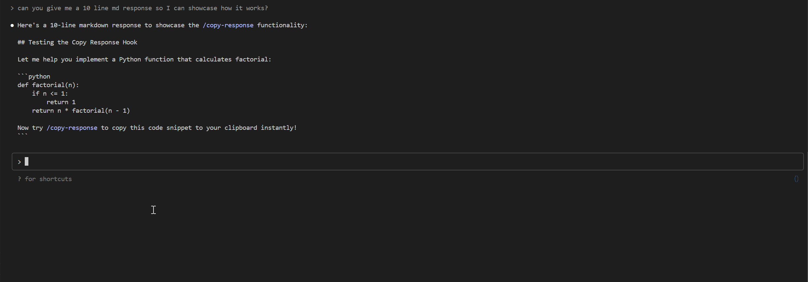

# Claude Code Response Copier

A Claude Code hook that adds a `/copy-response` command to quickly copy Claude's responses to your clipboard.



## Features

- 📋 **Quick Copy**: `/copy-response` copies the latest response
- 🔢 **Numbered Access**: `/copy-response 3` copies a specific response
- 📝 **List Responses**: `/copy-response list` shows available responses with previews
- 🔍 **Search Responses**: `/copy-response find "keyword"` finds responses containing text
- ⏰ **Timestamps**: Shows when each response was created
- 🖥️ **Cross-Platform**: Works on macOS, Linux, and Windows/WSL

## Installation

1. **Download the script:**

   ```bash
   curl -o copy-claude-response https://raw.githubusercontent.com/Twizzes/copy-claude-response/main/copy-claude-response
   chmod +x copy-claude-response
   ```

2. **Place it somewhere in your PATH** (or note the full path):

   ```bash
   mv copy-claude-response ~/.local/bin/
   ```

3. **Configure the hook** in your Claude Code settings (`~/.claude/settings.json`):

   ```json
   {
     "hooks": {
       "UserPromptSubmit": [
         {
           "hooks": [
             {
               "type": "command",
               "command": "/path/to/copy-claude-response"
             }
           ]
         }
       ]
     }
   }
   ```

## Usage

### Basic Commands

| Command | Description |
|---------|-------------|
| `/copy-response` | Copy the latest Claude response |
| `/copy-response 2` | Copy response #2 |
| `/copy-response list` | List last 10 responses with previews |
| `/copy-response list 5` | List last 5 responses |
| `/copy-response find "error"` | Find responses containing "error" |

### Examples

**Copy latest response:**

```
/copy-response
```

> Latest Claude response copied to clipboard!

**List recent responses:**

```
/copy-response list
```

```
Available responses (1-3):
    3 [ 2.1 min ago]: Here's the updated function with error handling...
    2 [15.3 min ago]: I'll help you debug this issue. First, let's check...
    1 [ 1.2 hrs ago]: To implement this feature, we need to modify...
```

**Search for specific content:**

```
/copy-response find "git commit"
```

```
Searching for "git commit":
    2 [15.3 min ago]: I'll help you debug this issue. First, let's check...
    5 [ 2.1 hrs ago]: You can create a git commit using the following...
Found 2 matching responses
```

## How It Works

The script:

1. **Intercepts** `/copy-response` commands before Claude processes them
2. **Parses** the conversation transcript to extract Claude's responses
3. **Groups** multi-part responses by request ID for complete responses
4. **Copies** the selected response to your system clipboard
5. **Blocks** the command from reaching Claude to prevent confusion

## Platform Support

- **macOS**: Uses `pbcopy`
- **Linux**: Uses `xclip` (install with `sudo apt install xclip`)
- **Windows/WSL**: Uses `clip.exe` via PowerShell for proper UTF-8 handling

## Troubleshooting

**Hook not working?**

- Run `/hooks` in Claude Code to verify the hook is registered
- Check that the script path is correct and executable
- Use `claude --debug` to see hook execution details

**Clipboard not working?**

- **Linux**: Install xclip: `sudo apt install xclip`
- **WSL**: Ensure Windows clipboard integration is enabled

**No responses found?**

- The script only finds text responses from Claude
- Responses with only tool calls won't appear in the list

**Hook not triggering?**

- Do not create a custom slash command named `/copy-response` - this will prevent the hook from triggering

## Limitations

- Only copies text responses from Claude (responses with only tool calls won't appear)
- The slash command WILL NOT AUTO-COMPLETE, this is because we are hooking UserPromptSubmission, which slash commands (that exist) do not trigger
- Requires `jq` for JSON parsing
- Platform-specific clipboard utilities must be installed

## Requirements

- Claude Code with hooks support
- Bash shell
- `jq` for JSON parsing
- Platform-specific clipboard utility (pbcopy/xclip/clip.exe)

## Contributing

Found a bug or have a feature request? Please open an issue or submit a pull request!

## License

Apache License 2.0 - feel free to modify and share!
